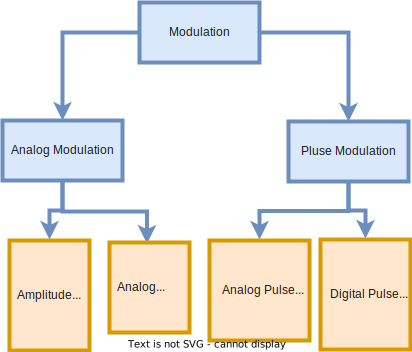

Modulation is the process of encoding the information onto the carrier signal in
a way that can be transmitted and received.

## Analog modulation methods

In analog modulation, the modulation is applied continuously in response to the
analog information signal. Common analog modulation techniques include:

### Amplitude modulation (AM)

Here the amplitude of the carrier signal is varied in accordance with the
instantaneous amplitude of the modulating signal.

#### Double-sideband modulation (DSB)

##### Double-sideband modulation with carrier (DSB-WC) (used on the AM radio broadcasting band)

##### Double-sideband suppressed-carrier transmission (DSB-SC)

##### Double-sideband reduced carrier transmission (DSB-RC)

#### Single-sideband modulation (SSB, or SSB-AM)

##### Single-sideband modulation with carrier (SSB-WC)

##### Single-sideband modulation suppressed carrier modulation (SSB-SC)

#### Vestigial sideband modulation (VSB, or VSB-AM)

#### Quadrature amplitude modulation (QAM)

### Angle modulation

Which is approximately constant envelope

#### Frequency modulation (FM)

Here the frequency of the carrier signal is varied in accordance with the
instantaneous amplitude of the modulating signal)

#### Phase modulation (PM)

Here the phase shift of the carrier signal is varied in accordance with the
instantaneous amplitude of the modulating signal)

#### Transpositional Modulation (TM),

Which the waveform inflection is modified resulting in a signal where each
quarter cycle is transposed in the modulation process. TM is a pseudo-analog
modulation (AM). Where an AM carrier also carries a phase variable phase f(ǿ).
TM is f(AM,ǿ)

## Pulse modulation methods

### Analog methods

#### Pulse-amplitude modulation (PAM)

#### Pulse-width modulation (PWM) and pulse-depth modulation (PDM)

#### Pulse-frequency modulation (PFM)

#### Pulse-position modulation (PPM)

### Digital methods

#### Pulse-code modulation (PCM)

##### Differential PCM (DPCM)

###### Adaptive DPCM (ADPCM)

#### Delta modulation (DM or Δ-modulation)

##### Delta-sigma modulation (ΣΔ)

##### Continuously variable slope delta modulation(CVSDM), also called adaptive delta modulation (ADM)

#### Pulse-density modulation (PDM)
